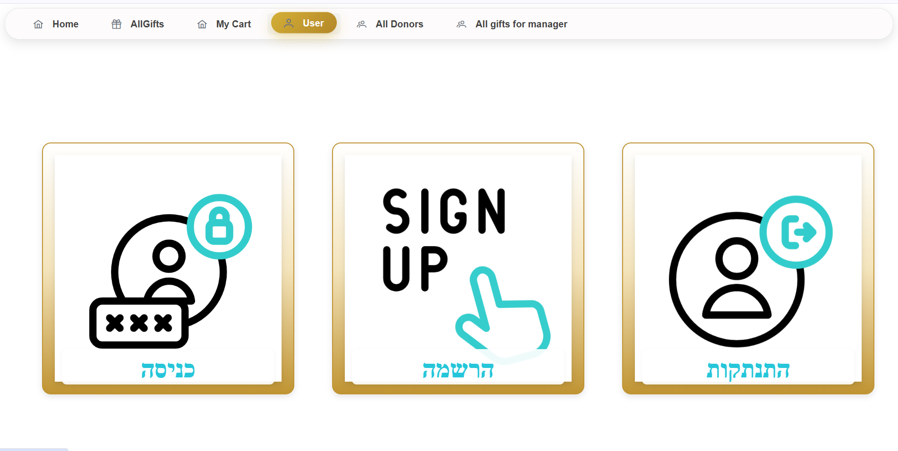
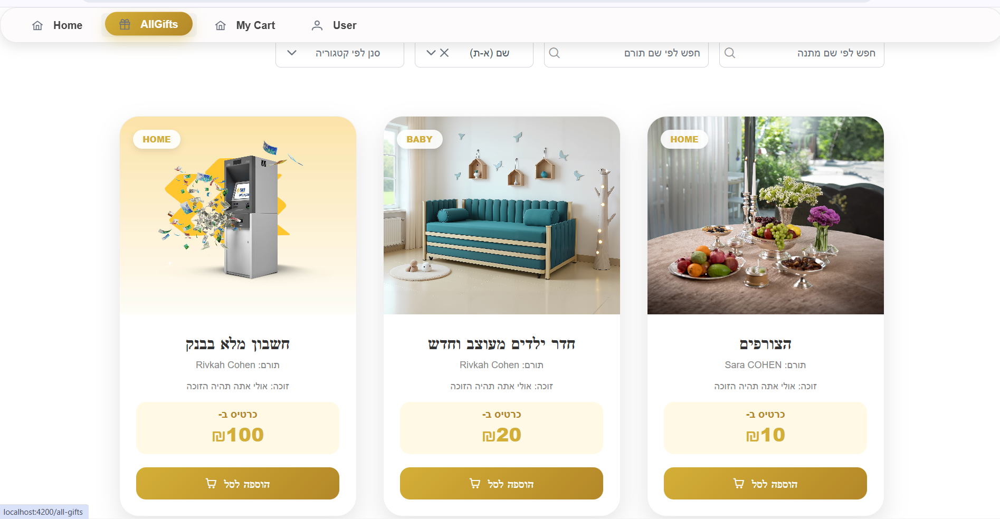
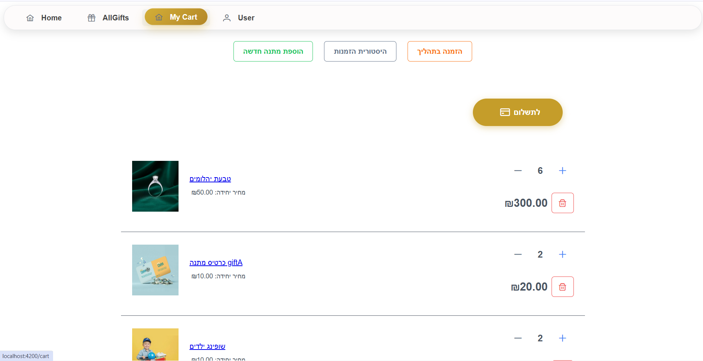
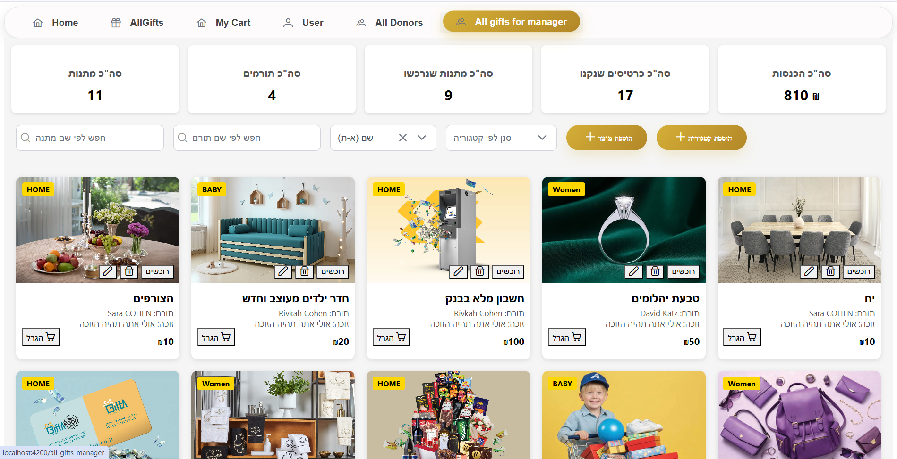

#  פרויקט Web Full-Stack 

##  סקירה כללית

פרויקט זה הוא פרויקט **Full-Stack** הכולל **Backend ב-.NET 8/9 Web API** ו־**Frontend ב-Angular 21**, לניהול **מכירה סינית מלאה**.

המערכת מאפשרת ניהול תורמים, מתנות, רכישות והגרלות, עם כניסה נפרדת למשתמשי הנהלה וללקוחות, אבטחת מידע מבוססת JWT, טיפול שגיאות ולוגים, ודוחות מפורטים בזמן אמת.

---

##  פיצ’רים מרכזיים

###  משתמש הנהלה

- כניסה מאובטחת עם **JWT** והגנה לפי **Roles**
- **ניהול תורמים**: צפייה, הוספה, עדכון, מחיקה, סינון לפי שם/מייל/מתנה
- **ניהול מתנות**: CRUD מלא, חיפוש, סינון, קטגוריות, תמונה, מחיר כרטיס הגרלה
- **ניהול רכישות**: צפייה, מיון לפי מחיר וכמות רכישות, הצגת פרטי רוכשים
- **הגרלה ודוחות**: ביצוע הגרלה, יצירת דוחות מנצחים והכנסות, שליחת מייל לזוכים

---

###  משתמש לקוח

- רישום וכניסה עם בדיקות וולידציה
- צפייה ברשימת מתנות עם מיון וסינון
- סל קניות עם שמירת טיוטא – ההנהלה רואה רק רכישות מאושרות
- צפייה במנצחים לאחר ההגרלה, ללא אפשרות רכישה

---

### פיצ’רים כלליים

- טיפול שגיאות באמצעות **Middleware + Logging**
- ניהול **Dependency Injection** בכל השכבות
- **Testing אוטומטי** ל-Backend (xUnit) ו-Frontend (Vitest)
- אינטגרציה מלאה בין Frontend ל-Backend

---

##  טכנולוגיות

### Backend

- .NET 8/9
- ASP.NET Core Web API
- Entity Framework Core – Code First
- SQL Server
- JWT Authentication + Role-based Authorization
- Logging עם Serilog
- Repository & Service Pattern
- Swagger / OpenAPI

---

### Frontend

- Angular 21
- TypeScript
- Reactive Forms & RxJS
- Server-Side Rendering (Angular Universal)
- SCSS + Prettier
- Dependency Injection
- יישום עקרונות SOLID

---
## מבנה הפרויקט

```text
Project/
├── client/AngularProject/
│   ├── Components/
│   ├── Services/
│   └── Models/
└── server/ApiProject/
    ├── Controllers/
    ├── Services/
    ├── Repositories/
    ├── MiddleWare/
    ├── Data/
    └── DTOs/Models/Logs/
    
---

##  אבטחה

- JWT Authentication
- Role-based Authorization
- Rate Limiting Middleware
- CORS מוגבל ל-Frontend
- Centralized Exception Handling

---

## 📸 Screenshots

### מסך התחברות 
עמוד התחברות מאובטח עם JWT ותמיכה בהרשאות לפי תפקיד.


---

###  רשימת מתנות
תצוגת מתנות עם מיון, סינון לפי קטגוריה וחיפוש מתקדם.


---

###  סל קניות
ניהול סל עם שמירת טיוטא ועדכון בזמן אמת לפני אישור רכישה.


---

### דף העדכון למנהל
ביצוע הגרלה, הצגת זוכים ודוח סיכום הכנסות.


---

 ## פרטי יוצר
פותח על ידי: אלה בליטי

לשאלות בנוגע לפרויקט זה, ניתן ליצור קשר דרך GitHub .או במייל


